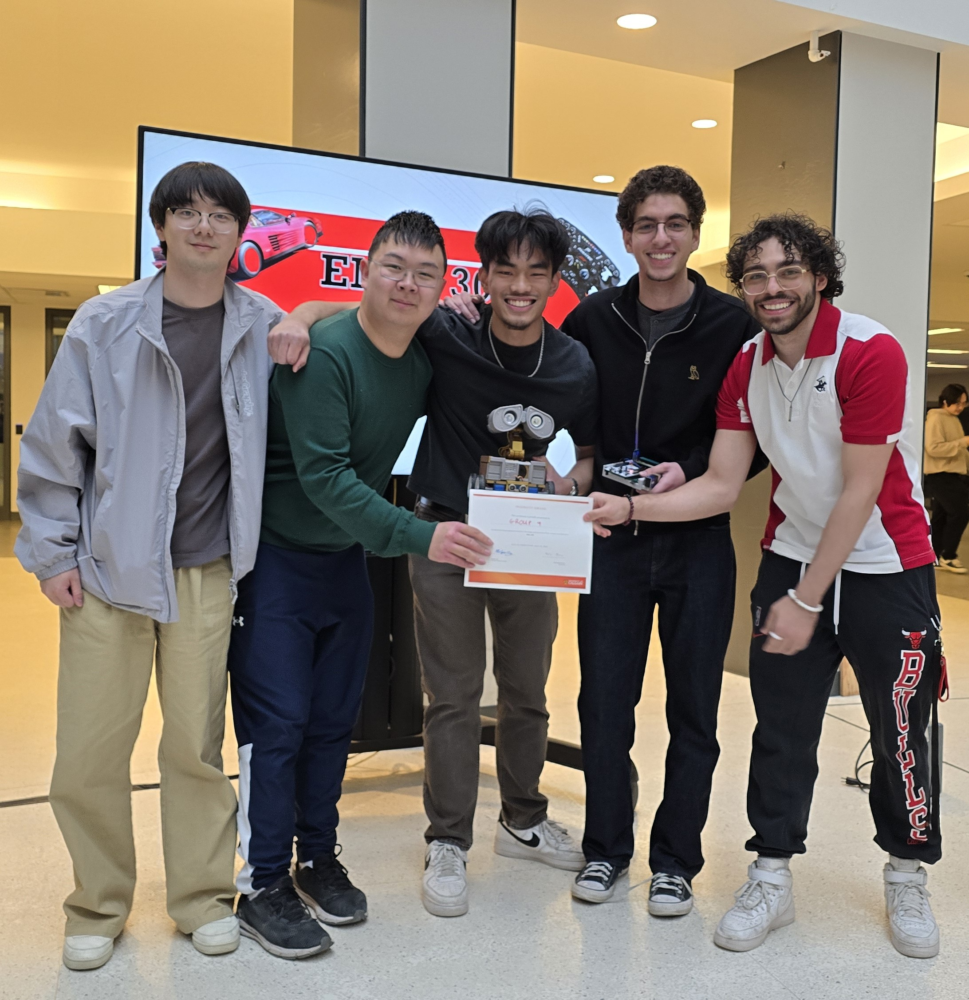
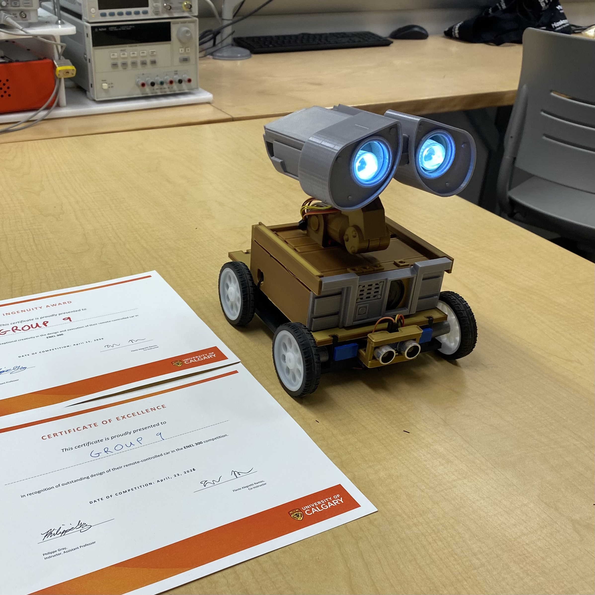

# STM32 Code as of Apr. 3, 2026

Inspired by Pixar’s 2008 film Wall-E, our team has designed a remote controlled car and its onboard telemetry system, including:

1. A 3D-printed car, modeled after the fan-favourite robot Wall-E
2. A main onboard PCB containing an STM32 that handles motor control for movement, telemetry logic, and power supply.
3. A secondary onboard PCB dedicated to handling metal detection.
4. Various sensors and parts for metal detection, noise generation, object detection, light generation, and secondary motor control (neck swivel movement).
5. Store-bought wheels, motors and battery used with 3D-printed motor adapters
6. A remote PCB containing another STM32 that handles 
Sending movement data and toggling lights for the car
Receiving and processing raw data relating to the onboard object detection
The remote PCB’s 3D-printed shell.

Ultimately, our car found success in the end-of-term classwide competition, winning the #1 Ingenuity Award, displaying outstanding creative and technical design, as well as ranking 4th in the timed challenge. 

Unofficially, our car has also become a “people’s favourite” amongst TA’s and students alike for its striking resemblance to the playful robot that it is inspired by. We can proudly say that a countless number of our peers (and even TAs!) have described our car as their favourite. 

## Project Images

 

## Features

- **Dual motor control (DRV8833)** using PWM signals (2 pins per motor)
- **Bluetooth serial communication (HC-05, slave mode)** using USART TX/RX
- **Metal detection sensing** using an ADC input and a GPIO output
- **Object detection sensing** using microsecond-resolution pulses
- **Noise and light generation**

 

## Pin Assignments

## Pin Configuration Diagram

 

## STM Connections 

